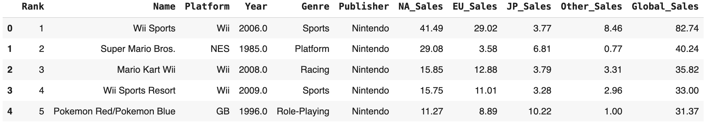
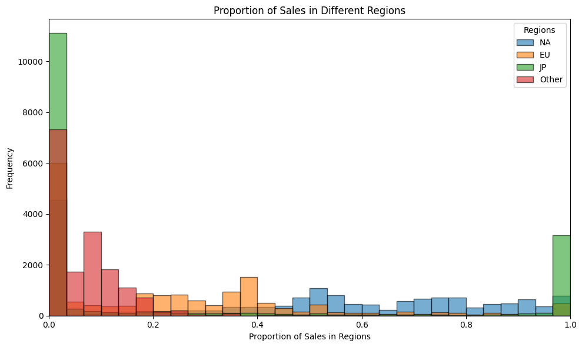

# Final Project: Global Video Game Sales Analytics with Machine Learning

Yifan Sun

Department of Earth, Planetary, and Space Sciences, UCLA

AOS C204: Introduction to Machine Learning for Physical Sciences

Instructor: Dr. Alexander Lozinski

Dec. 6 2024

## Introduction

In an increasingly competitive and dynamic video game market, effective advertising strategies hinge on a clear understanding of the factors that drive global sales. Given a [dataset from Kaggle](https://www.kaggle.com/datasets/gregorut/videogamesales/data) containing video game sales and related information, we would like to understand the game selling situation around the world and influencing factors and to develop a suitable advertising strategy according to the situation. In this project, we will try to solve the following question:
* In which region will the game sell the most?
  With the popularisation of the internet, people around the world may have access to video games (Yufa et. al [^1]). However, diverse cultural backgrounds, local economic conditions, levels of technological development, etc, could greatly affect the sales of different kinds of video games. With the information on the best sales region, we will be able to decide on suitable advertising volume for regions and know our advertising key areas.

In this project, we will use different machine learning models and algorithms, including Neural Network, Decision Tree, etc, to study and solve them. We are going to present our results and analyze them in order to get a better understanding of the dataset and seek for deeper insights. Here is the [Google Colab notebook] () that includes my code.

## Data

Our data comes from the Video Game Sales dataset in Kaggle. All data was generated by a scrape of vgchartz.com [^2]. The dataset contains 16598 different games with 11 separate fields. Below is a quick view of the dataset (picked by the first five rows). We can see from the graph that the
fields include Sale Rank, Game Name, Release Platform, Release Year, Publisher, Sales in NA, Sales in EU, Sales in JP, Sales in other places, and Global Sales.

In order to approach our research question, we transform sales into proportions and draw the histogram of proportion of sales in different regions. 

From the graph, we figure out that there are large differences between sales of games in different regions. Also, when we randomly choose five games in the datasets several times, we always see that for different games, their main sale regions are different. Therefore, our dataset is suited to fit the problem of predicting the region with the most sales for each game.

According to the question, we need to find the most popular area, but there is no “most popular area” in the dataset. As a result, we write a lambda function and add a column to the data that can filter out the best sale area. There are 4 different areas we considered – NA, EU, JP and Other. We numbered them into NA – 1, EU –2, JP – 3 and Other – 0 to simplify the classification process. In addition, for each unique publisher and Genre, we give them a number in the range of [0, number of unique cases). Here are the new columns we added:
* publisher_label: numerical label for publishers in range of [0, number of unique publishers)
* genre_label: numerical label for genre in range of [0, number of unique genres)

Besides, among the eleven fields, the field of Year should be seen as a biased term. With the development of technology and the progress of society, both the game equipment and the audience of the game are changing. Therefore, the release year will bias the sale of game genres in different platforms and regions. When evaluating results, we need to count the bias taken by the field of year.

## Modeling

I use two different machine learning models to solve the question: a Neural Network and a Random Forest Classifier.

### Model 1 - Neural Network with Optimization
This model utilizes a Neural Network to predict the region where a video game will achieve the highest sales. The prediction is based on a combination of numerical and categorical features, including Year (Numerical, Discrete), Genre (Categorial),  Publisher (Categorial). To ensure compatibility with the neural network, the categorical features, genre and publisher, are encoded into numerical labels (genre_label and publisher_label), allowing the model to effectively learn patterns in the data.
With these features, we trained neural network:
* Hidden Layer 1: Relu Activation to 128 units
* Hidden Layer 2: Relu Activation to 128 units
* Final Activation Function: Relu Activation to 1 unit
* Batch Size: 64
* Epochs: 100
* Loss Function: Mean Square

We trained it with 2 different optimizers. For each optimizer, manually try different learning rate and find a suitable learning rate that is:
• Adam Optimizer with Mean Square Error Loss function: 0.05
• RMSprop Optimizer with Mean Square Error Loss function: 0.001

### Model 2 - Random Forest Classifier
This model uses a Random Forest Classifier to solve the same question. In this model, we use the same features as Model 1 (Year (Numerical, Discrete), Genre (Categorial), Publisher (Categorial), and the two added labels publisher_label and genre_label) to predict the most popular area for the game. 
With these features, we trained a Random Forest with params listed:
* Number of trees in the forest: 1000
* Max_depth: None

In order to improve the results of our Random Forest Model, we do model hyperparameter tuning. In order to avoid overfitting, we use K-fold Cross Validation. With the help of Scikit-Learn RandomizedSearchCV, we define a grid of hyperparameters,and randomly sample from the grid, and perform Cross Validation with a selected combination of values.
Below are the Random Forest Hyperparameters we’ll be looking at:
* n_estimators: number of trees in the random forest
* max_features: number of features to consider at every split
* max_depth: maximum number of levels in the tree
* min_samples_split: minimum number of samples required to split a node
* min_samples_leaf: minimum number of samples required at each leaf node

After fitting the random search, we got the best hyperparameters:
* `n_estimators = 1800`,
* `min_samples_split = 10`,
* `min_samples_leaf = 1`,
* `max_features = log2`,
* `max_depth = 560`,
* `criterion = gini`

## Results

### Model 1 - Neural Network

* Adam Optimizer

For the other neural networks trained with Adam Optimizer, it reaches an accuracy of 61% after 2 epochs for training data and stays unchanged. The accuracy for validation data is about 60% and the loss for validation data is about 0. They stay unchanged for all epochs. (Figure 5)

When we use test data to test the accuracy, we get a loss of 0.7277 and an accuracy of 61%.

* RMSprop Optimizer

After about 18 epochs, the accuracy and loss remain unchanged for the training and validation data. The accuracy for the training and validation dataset reached about 60% and the loss decreased to nearly 0 (Figure 5).

When we use the test dataset to test on the performance, we get a loss of 0.7854 and accuracy 60.54%.

### Model 2 - Random Forest Classifier

## Discussion

Both neural networks and random forest classifiers demonstrate higher accuracy compared to randomly selecting the best-selling area. However, the random forest classifier, particularly when optimized, achieves a more practical accuracy of approximately 75%, making it a reliable tool for video game sellers to guide advertising investments.

When comparing the two methods, neural networks require significantly larger datasets to make precise predictions. As shown in our results, neural networks fail to achieve high accuracy despite using optimizers such as Adam and RMSprop, whereas the random forest classifier consistently delivers better performance. A possible reason for this is the relatively small size of our dataset, which consists of 13,278 training samples. This dataset is insufficient for fully training a neural network, often resulting in overfitting due to the model’s inability to generalize across the entire video game sales market. Additionally, random forests are inherently well-suited for handling nonlinear data (Roßbach, 2018 [^3]). Since all input features in this study—such as genre and publisher—are categorical and nonlinear, the random forest classifier is better equipped to capture these relationships, leading to higher accuracy than neural networks.

One limitation of the random forest model is its computational runtime. In our current implementation, optimization through hyperparameter tuning only marginally improved accuracy, with gains ranging from 0.1% to 1%. Achieving further accuracy improvements would require increasing the number of iterations or cross-validation folds, which would significantly increase runtime. This trade-off between accuracy and computational efficiency limits the model’s scalability. 

## Conclusion

In this project, we explored the use of neural networks and random forest classifiers to predict the region with the highest sales for video games, based on features such as year of release, genre, and publisher. Our results demonstrate that while both models outperform random guessing, the random forest classifier consistently achieved higher accuracy, with an optimized accuracy of approximately 75%. This makes it a practical tool for video game sellers to allocate advertising resources effectively.

This project emphasizes the importance of selecting appropriate machine learning models based on the nature of the dataset and problem domain. While random forest models performed well, future work could explore techniques to address the limitations of neural networks on small datasets, such as data augmentation or transfer learning. Additionally, further optimization of the random forest model, including tuning hyperparameters and exploring alternative ensemble methods, could enhance performance. Overall, this study provides a way to use machine learning to guide strategic decision-making in the video game sales industry.

## References

[^1]: [Yufa, A., Yu, J. L., Chan, H. & Berger, P. D. (2019) Predicting global video-game sales. Quest Journals. https://www.questjournals.org/jrbm/papers/vol7-issue3/I07036064.pdf](https://www.questjournals.org/jrbm/papers/vol7-issue3/I07036064.pdf)
[^2]: [vgchartz](http://www.vgchartz.com/)
[^3]: [Roßbach. (2018). Neural Networks vs. Random Forests – Does it always have to be Deep Learning? https://blog.frankfurt-school.de/wp-content/uploads/2018/10/Neural-Networks-vs-Random-Forests.pdf](https://blog.frankfurt-school.de/wp-content/uploads/2018/10/Neural-Networks-vs-Random-Forests.pdf)
